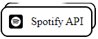

<svg xmlns="http://www.w3.org/2000/svg" xmlns:xlink="http://www.w3.org/1999/xlink" style="z-index:1;position:relative" width="800" height="200" viewBox="0 0 854 200">
    <g transform="translate(427, 100) scale(1, 1) translate(-427, -100)">                    
        <defs>
	        <linearGradient id="linear" x1="0%" y1="0%" x2="100%" y2="0%">
		    <stop offset="0%" stop-color="#004FF9"/><stop offset="100%" stop-color="#FFF94C"/>
		    </linearGradient>
        </defs>				
        <path d="" fill="url(#linear)" opacity="0.4">
            <animate attributeName="d" dur="20s" repeatCount="indefinite" keyTimes="0;0.333;0.667;1" calcmod="spline" keySplines="0.2 0 0.2 1;0.2 0 0.2 1;0.2 0 0.2 1" begin="0s" values="M0 0L 0 120Q 213.5 160 427 130T 854 155L 854 0 Z;M0 0L 0 145Q 213.5 160 427 140T 854 130L 854 0 Z;M0 0L 0 165Q 213.5 135 427 165T 854 130L 854 0 Z;M0 0L 0 120Q 213.5 160 427 130T 854 155L 854 0 Z"/>
        </path>
        <path d="" fill="url(#linear)" opacity="0.4">
            <animate attributeName="d" dur="20s" repeatCount="indefinite" keyTimes="0;0.333;0.667;1" calcmod="spline" keySplines="0.2 0 0.2 1;0.2 0 0.2 1;0.2 0 0.2 1" begin="-10s" values="M0 0L 0 135Q 213.5 180 427 150T 854 160L 854 0 Z;M0 0L 0 150Q 213.5 120 427 120T 854 140L 854 0 Z;M0 0L 0 145Q 213.5 125 427 150T 854 165L 854 0 Z;M0 0L 0 135Q 213.5 180 427 150T 854 160L 854 0 Z"/>
        </path>
    </g>                
        <text text-anchor="middle" alignment-baseline="middle" x="50%" y="35%" class="text" font-size="48px" font-weight="700" style="fill:#f7f5f5;" stroke="#none" stroke-width="1">Hello there! 👋 I'm Francisco</text>
        <text text-anchor="middle"  font-size="20px" font-weight="500" alignment-baseline="middle" x="62%" y="55%" class="desc" style="fill:#f7f5f5;">I'm a Front End developer
        </text> 
</svg>

## Contact me, let's talk

 

---

## About Me

I'm a young person with pasion for programming who always try to maintain myself evolving my habilities as a developer and learning new things.

I'm actually on my way to be a Full Stack Developer :)

---

## Frameworks and Tools I worked with

Languages:

   

Frameworks:

Web Design:

 

Others:

     

