

## Contact me, let's talk

<a href="https://francisco-muniz.netlify.app" target="_blank">
    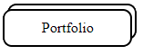
</a> 
<a href="https://www.linkedin.com/in/francisco-muñiz-011010232/" target="_blank">
    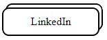
</a>

---

## About Me

I'm a young person with pasion for programming who always try to maintain myself evolving my habilities as a developer and learning new things.

I'm actually on my way to be a Full Stack Developer :)

---

## Frameworks and Tools I worked with

Languages:

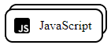 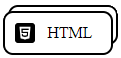 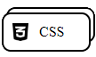 

Frameworks:

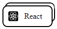

Web Design:

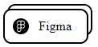 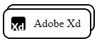

Others:

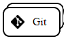 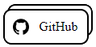 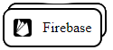  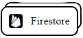 

