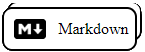

## Contact me, let's talk

 

---

## About Me

I'm a young person with pasion for programming who always try to maintain myself evolving my habilities as a developer and learning new things.

I'm actually on my way to be a Full Stack Developer :)

---

## Frameworks and Tools I worked with

Languages:

   

Frameworks:

Web Design:

 

Others:

     

